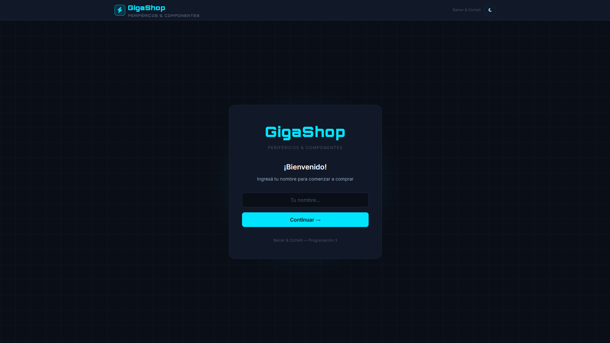
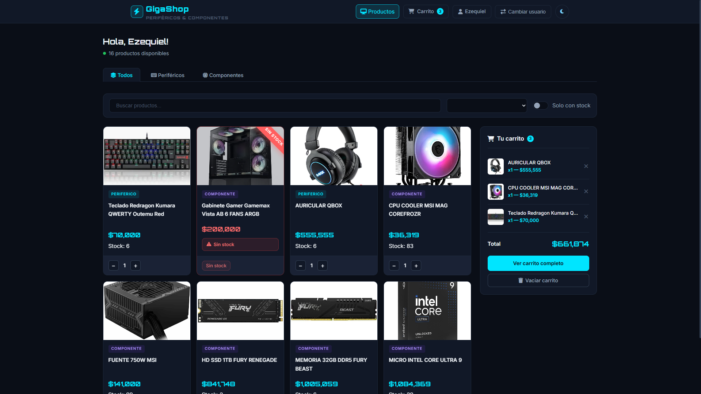
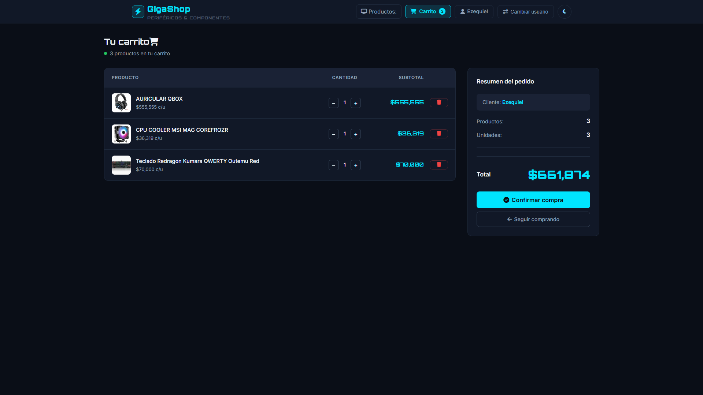
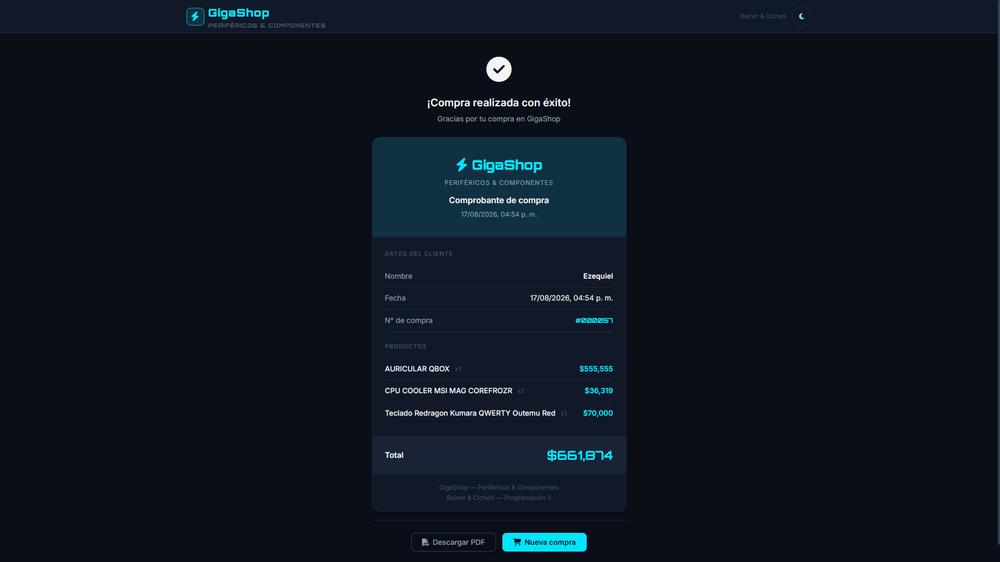
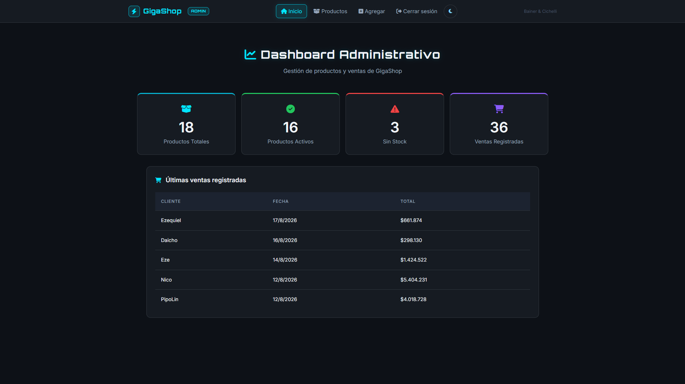
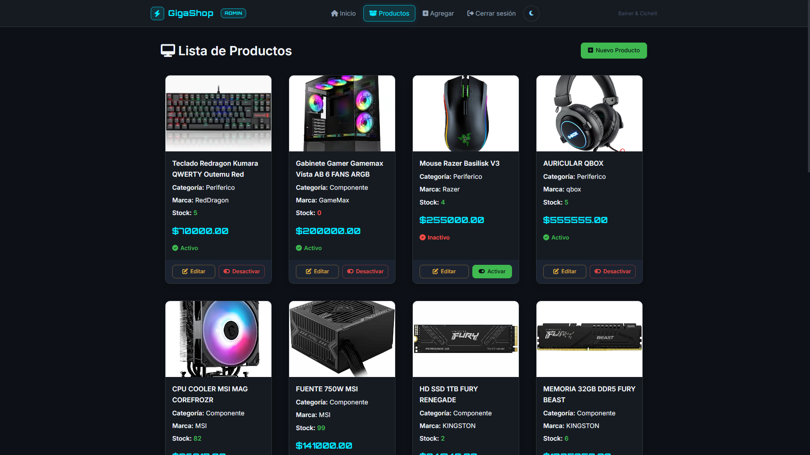

# 🛒 GigaShop

Sistema de gestión para un autoservicio de productos tecnológicos desarrollado como Trabajo Práctico Integrador para **Programación III**.

---

## 🌐 Demo Online

### Frontend Cliente
https://bainer-cichelli-tp.vercel.app/frontend/

### Panel Administrador
https://bainer-cichelli-tp.vercel.app/login

---

## 📸 Capturas de Pantalla

### Pantalla de Bienvenida

### Catálogo de Productos

### Carrito de Compras

### Ticket de Compra

### Dashboard Administrativo

### Gestión de Productos

---

## 👥 Integrantes

- Nicolás Ezequiel Bainer
- Lucía Fiorella Cicchelli

---

# 📌 Descripción

La aplicación está compuesta por dos módulos principales:

## 🛍️ Frontend Cliente

Permite al usuario:

- Visualizar productos disponibles.
- Filtrar y buscar productos.
- Agregar productos al carrito.
- Modificar cantidades.
- Confirmar compras.
- Generar y descargar un comprobante PDF.

## ⚙️ Panel de Administración

Permite al administrador:

- Iniciar sesión.
- Gestionar productos mediante operaciones CRUD.
- Activar y desactivar productos.
- Gestionar imágenes.
- Consultar ventas realizadas.

---

# ☁️ Deployment

La aplicación se encuentra desplegada en producción utilizando:

- **Vercel** para el hosting de la aplicación.
- **Supabase** como base de datos PostgreSQL.
- **Prisma ORM** para el acceso y gestión de datos.

Este despliegue permitió trabajar con una arquitectura full stack real, utilizando servicios cloud para la publicación del proyecto.

---

# 🚀 Tecnologías utilizadas

## Backend

- Node.js
- Express.js
- Prisma ORM
- PostgreSQL (Supabase)
- Express Session
- Multer
- bcrypt

## Frontend

- HTML5
- CSS3
- JavaScript
- Fetch API
- jsPDF

---

# 🎓 Aprendizajes

Durante el desarrollo de este proyecto se aplicaron y reforzaron conocimientos relacionados con:

- Arquitectura MVC.
- Diseño e implementación de APIs REST.
- Persistencia de datos utilizando Prisma ORM.
- Modelado relacional en PostgreSQL.
- Gestión de sesiones y autenticación.
- Manejo de archivos e imágenes con Multer.
- Consumo de APIs mediante Fetch API.
- Generación de documentos PDF desde el navegador.
- Validaciones del lado cliente y servidor.
- Deploy de aplicaciones Node.js utilizando Vercel.
- Integración de aplicaciones con bases de datos en Supabase.
- Trabajo colaborativo utilizando Git y GitHub.

---